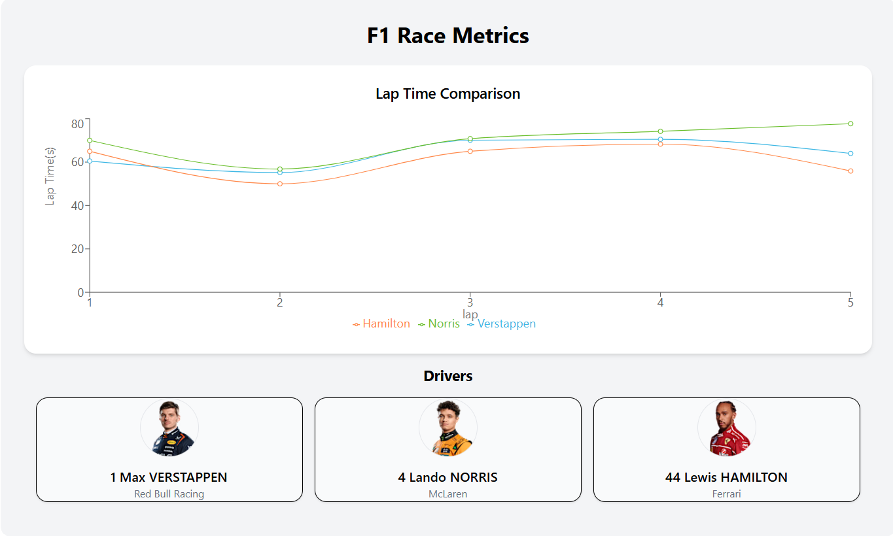

A lightweight web application built with React, Vite and Tailwind CSS.
This application is designed to visualise lap-time data and race perfomance insights inpsired by F1 engineering 
workflows.

This projects uses the OpenF1 API (https://openf1.org/) to currently fetch live F1 driver data

- Currently displaying the Driver's name, team and number of selected drivers (Hamilton, Norris and Verstappen).

Note: 
- API integration was initially implemented to fetch live lap data but failed as API often retured "429 too many requests"
- Therefore added safe fallback to the original mock data being used to make sure the chart renders data
- However, application is ready to switch to live data once it is available.

